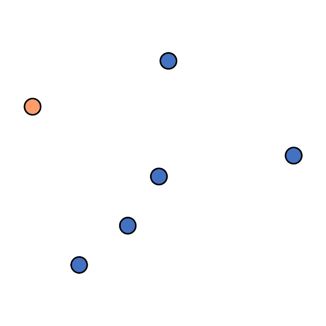
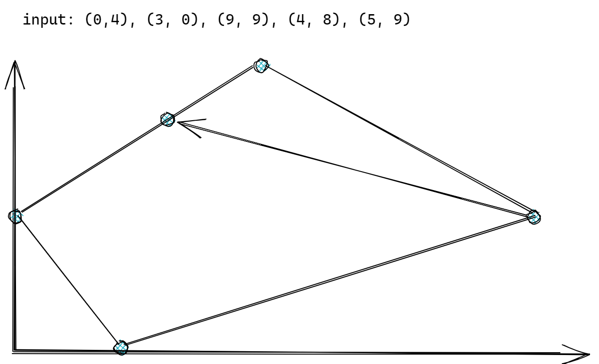

平面上给定若干点，则它们的 **凸包** 被定义为所有能包含所有点的凸多边形的交集。这就好像桌面上有很多图钉，然后用一根橡皮筋套在图钉外围。

## Graham Scan 

选取最左下角的一个点（这里指以横坐标为第一关键词、纵坐标为第二关键词排序后最小的点），我们以这个点为极点进行极角排序。将极角排序后的点依次相连即可得到一个包围所有点的多边形。但是这个多边形不一定是凸的，我们需要做出调整。

我们维护一个栈，按照极角排序后的顺序遍历每个点。
- 如果栈中点数小于 3，就直接进栈；
- 否则，检查栈顶三个点组成的两个向量的旋转方向是否为逆时针（这可以用叉乘判断），若是则进栈，若不是则弹出栈顶，直到栈中点数小于 3 或者满足逆时针条件为止。

最后将栈内的点连起来便可得到凸包。

在极角排序的情况下，如果想要组成凸多边形，向量就肯定应该不断逆时针旋转。例如下图中橙色处是逆时针，可以接受；蓝色处是顺时针，不可以接受。

---

极角排序可以参考 :a[Sorting by Polar Angle]{href=/posts/algorithms&data-structures/computational-geometry/sorting-by-polar-angle .nav}. 在这里，因为我们选定的起点为最左边的点，那么所有的向量一定在第一第四象限，彼此相邻，则可以直接通过叉乘判断旋转方向。

若我们要求输出所有在凸包上的点，那么我们需要在排序的时候对在同一向量方向上的点进行特别处理。考虑以下情况，

如果我们极角排序的结果，`(4, 8)` 在 `(5, 9)` 前的话，最后的栈将不包含 `(4, 8)`。

The trick is that once all points are sorted by polar angle with respect to the reference point:
- For collinear points in the begin positions, make sure they are sorted by distance to reference point in ascending order.
- For collinear points in the end positions, make sure they are sorted by distance to reference point in descending order.