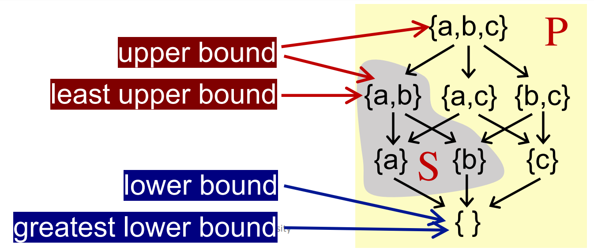
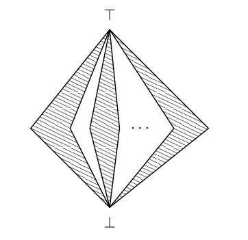

**Definition**: A relation $R$ on a set $S$ is called a partial order if it is (partial means for a pair of set elements in $P$, they could be incomparable.
- reflexive: $\forall x \in P, x \sqsubseteq x$
- antisymmetric: $\forall x, y \in P, x \sqsubseteq y \wedge y \sqsubseteq x \Rightarrow x = y$
- transitive: $\forall x, y, z \in P, x \sqsubseteq y \wedge y \sqsubseteq z \Rightarrow x \sqsubseteq z$

**Definition**: A set $S$ together with a partial ordering $R$ is called a partially ordered set or poset for short 

---

**Definition**: Given a poset $(P, \sqsubseteq)$ and its subset $S$ that $S \subseteq P$, we say that
- $u \in P$ is an upper bound of S, if $\forall x \in S, x \sqsubseteq u$
- $l \in P$ is a lower bound of S, if $\forall x \in S, l \sqsubseteq x$
- least upper bound (lub or join) of $S$, written $\sqcup S$, if for every upper bound of $S$, say $u$, $\sqcup S \sqsubseteq u$
- greatest lower bound (glb or meet) of $S$, written $\sqcap S$, if for every lower bound of $S$, say $l$, $l \sqsubseteq \sqcup S$

Usaually, if $S$ contains only two elements $a$ and $b$ ($S = \{a, b\}$), then 
- $\sqcap S$ can be written as $a \sqcup b$ (the join of $a$ and $b$)
- $\sqcup S$ can be written as $a \sqcap b$ (the meet of $a$ and $b$)

Note that not every poset has lub or glb, but if a poset has lub or glb, it will be **unique**\
Proof. assume $a$ and $b$ are both glbs of poset $P$\
:indent[because $a$ is the glb then $b \sqsubseteq a$; because $b$ is the glb then $a \sqsubseteq b$]\
:indent[by the antisymmetry of partial order $a = b$, so the glb is unique. ]

## Lattice

**Definition**: Given a poset, $\forall a, b \in P$, if $a \sqcup b$ and $a \sqcap b$ exist, then its called a **lattice**
- In other words, a poset is called lattice if every pair of its elements has a least upper bound and a greatest lower bound

---

**Definition**: All subsets of a lattice have a least upper bound and a greatest lower bound 
- the lub is called top 
- the glb is called bottom $\perp$

**Definition**: The height of a lattice h is the length of the longest path from Top to Bottom in the lattice

---

**Definition**: lattice $A$ 是分配的（distributive），当且仅当：
- $(a \sqcup b) \sqcap c=(a \sqcap c) \sqcup(b \sqcap c)$
- $(a \sqcap b) \sqcup c=(a \sqcup c) \sqcap(b \sqcup c)$

---

**Definition**: If only $a \sqcup b$ exists, then it's called a **join semilattice**

**Definition**: If only $a \sqcap b$ exists, then it's called a **meet semilattice**

**Definition**: Given a lattice, for arbitrary subset $S$, if $\sqcap S$ and $\sqcup S$ exist, then it's called a complete lattice

- e.g., $(S, \sqsubseteq)$ is not a complete lattice where $S$ is a set of integers and $\sqsubseteq$ represents $\leq$
    - the subset represents all even numbers has no least upper bound.

**Theorem**: Every finite lattice is a complete lattice.
Proof. TODO

---

**Definition**: Given lattices $L1 = (P_1, \sqsubseteq_1), \cdots, L1 = (P_n, \sqsubseteq_n)$, if $\forall i, L_i$ has least upper bound and greatest lower bound, then we can have a **Product Lattice** defined by 
- $P = P _{1} \times \ldots \times P _{ n }$
- $( x _{1}, \ldots, x _{ n }) \sqsubseteq( y _{1}, \ldots, y _{ n }) \Leftrightarrow( x _{1} \sqsubseteq y _{1}) \wedge \ldots \wedge( x _{ n } \sqsubseteq y _{ n })$
- $( x _{1}, \ldots, x _{ n }) \sqcup( y _{1}, \ldots, y _{ n })=( x _{1} \sqcup_{1} y _{1}, \ldots, x _{ n } \sqcup_{ n } y _{ n })$
- $( x _{1}, \ldots, x _{ n }) \sqcap( y _{1}, \ldots, y _{ n })=( x _{1} \sqcap_{1} y _{1}, \ldots, x _{ n } \sqcap_{ n } y _{ n })$

**Lemma**: If all latices are complete lattices, then the product lattice is a complete lattice

### Fixed-Point Theorem 

A function $$f: L \rightarrow L$$ is monotone when $\forall x, y \in S: x \sqsubseteq y \Rightarrow f(x) \sqsubseteq f(y)$
- e.g., a constant function
- e.g., functions $\sqcup$ and $\sqcap$ are monotone in both arguments.
:::indent
$\forall x, y, z \in L, x \subseteq y$, we want to prove $x \sqcup z \sqsubseteq y \sqcup z$

- by definition of $\sqcup$, $y \subseteq y \sqcup z$, $z \subseteq y \sqcup z$
- by transitivity of $\subseteq$, $x \subseteq y \subseteq y \sqcup z$

thus $y \sqcup z$ is an upper bound for $x$ and also for $z$, then we have $x \sqcup z \sqsubseteq y \sqcup z$

:::

---

**Definition**: In a lattice $L$ with finite height, every monotone function $f$ has a unique least fixed-point. \
The least fixed point of $f$ can be found by iterating $f (\perp), f ( f (\perp)), \ldots, f ^{ k }(\perp)$ until a fixed point is reached. 

We have an increasing chain:

$$
\perp \sqsubseteq f(\perp) \sqsubseteq f^{2}(\perp) \sqsubseteq \cdots
$$

Since $L$ is assumed to have finite height, we must for some $k$ have that $f^{k}(\perp) = f^{k+1}(\perp)$.\
We define $fix(f)=f^{k}(\perp)$ and since $f(fix(f))=f^{k+1}(\perp)=f^{k}(\perp)=fix(f)$, we know that $fix(f)$ is a fixed-point.

Assume now that $x$ is another fixed-point. Since $\perp \sqsubseteq x$ it follows that $f(\perp) \sqsubseteq f(x)=x$, since $f$ is monotone and by induction we get that $f x(f)=f^{k}(\perp) \sqsubseteq x$. Hence, $fix(f)$ is the least fixed-point. By anti-symmetry, it is also unique.

Similarly, the greatest fixed point of $f$ can be found by iterating $f (T), f ( f (T)), \ldots, f ^{ k }(T)$ until a fixed point is reached.

### Closure Properties

**Definition**: If $L_{1}, L_{2}, \ldots, L_{n}$ are lattices with finite height, then so is the product:

$$
L_{1} \times L_{2} \times \ldots \times L_{n}=\left\{\left(x_{1}, x_{2}, \ldots, x_{n}\right) \mid x_{i} \in L_{i}\right\}
$$

where $\sqsubseteq$ is defined pointwise. Note that $\sqcup$ and $\sqcap$ can be computed pointwise. 

$h e i g h t\left(L_{1} \times \ldots \times L_{n}\right)=h e i g h t\left(L_{1}\right)+\ldots+$ height $\left(L_{n}\right)$

**Definition**: If $L_{1}, L_{2}, \ldots, L_{n}$ are lattices with finite height, then so is the sum:

$$
L_{1}+L_{2}+\ldots+L_{n}=\left\{\left(i, x_{i}\right) \mid x_{i} \in L_{i} \backslash\{\perp, \top\}\right\} \cup\{\perp, \top\}
$$

where $(i, x) \sqsubseteq(j, y)$ iff $i=j$ and $x \sqsubseteq y$

$h e i g h t\left(L_{1}+\ldots+L_{n}\right)=\max \left\{\operatorname{height}\left(L_{i}\right)\right\}$

---

Data Flow Analysis 可被看作沿某方向（正向分析或逆向分析），不停的应用 $F : V ^{ k } \rightarrow V ^{ k }$ 直到达到某不动点